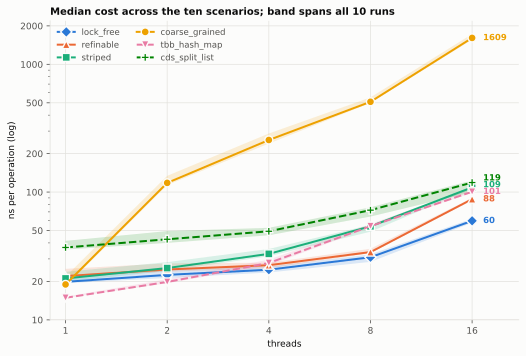

# Concurrent Hash Sets

This repo contains four concurrent hash set implementations in C++, measured against [Intel oneTBB](https://github.com/uxlfoundation/oneTBB) and [libcds](https://github.com/khizmax/libcds).

These results are based on **30 independent benchmark runs**; see
[Keeping the comparison fair](#keeping-the-comparison-fair) for more details on the methodology.

## Designs

There are four implementations in this repository:

| | |
|---|---|
| `coarse_grained` | `HashSetCoarseGrained` - One mutex over the whole set |
| `striped` | `HashSetStriped` - Fixed array of mutexes, never resized |
| `refinable` | `HashSetRefinable` - Mutex arena that grows with the table |
| `lock_free` | `HashSetLockFree` - Split-ordered list, epoch-based reclamation |

and two external implementations (enabled with `USE_BASELINES=ON`):

| | |
|---|---|
| `tbb_hash_map` | oneTBB v2022.3.0, `tbb::concurrent_hash_map`. Locks each bucket with a spin reader-writer lock, so it's more similar to `striped` and `refinable`. |
| `cds_split_list` | libcds 9985d2a, `cds::container::SplitListSet`. Implements the same split-ordered list as `HashSetLockFree`, reclaiming with [hazard pointers](https://en.wikipedia.org/wiki/Hazard_pointer) instead of epoch-based reclamation. |

## Benchmarking scenarios

Ten scenarios, each at 1, 2, 4, 8 and 16 threads:

| Scenario | Contains/Add/Remove Share% | Keys | Initial capacity | notes |
|---|---|---|---|---|
| `contains_only` | 100/0/0 | 4096 | 8192 | Never writes |
| `read_heavy_small` | 90/5/5 | 4096 | 8192 | |
| `read_heavy_large` | 90/5/5 | 1048576 | 2097152 | |
| `balanced_small` | 50/25/25 | 4096 | 8192 | |
| `balanced_large` | 50/25/25 | 1048576 | 2097152 | |
| `write_heavy` | 20/40/40 | 4096 | 8192 | |
| `disjoint_keys` | 50/25/25 | 1048576 | 2097152 | Each thread owns its keys |
| `skewed` | 50/25/25 | 1048576 | 2097152 | 90% of accesses on a hot spot |
| `outgrown_capacity` | 90/5/5 | 1048576 | 4 | Starts too small |
| `growth` | 0/100/0 | 524288 | 1024 | No prefill, resizes throughout |

(It's worth noting here that oneTBB's `tbb::concurrent_unordered_set` is a split-ordered list too, but unfortunately its only remove is `unsafe_erase` which may not run concurrently, so it cannot run the eight scenarios that remove.)

## Results

Every number below is a median across all ten scenarios. 

<picture>
  <source media="(prefers-color-scheme: dark)" srcset="docs/scaling-dark.svg">
  
</picture>

| | 1 | 2 | 4 | 8 | 16 | 1 -> 16 |
|---|---|---|---|---|---|---|
| `lock_free` | 19.8 | 22.5 | 24.7 | 30.9 | **59.6** | **3.0x** |
| `refinable` | 22.0 | 24.8 | 26.8 | 33.9 | 88.0 | 4.0x |
| `striped` | 21.1 | 25.4 | 32.8 | 53.9 | 108.8 | 5.1x |
| `tbb_hash_map` | **14.9** | 19.8 | 27.9 | 54.1 | 100.6 | 6.8x |
| `cds_split_list` | 36.8 | 42.7 | 49.3 | 72.2 | 118.8 | 3.0x |
| `coarse_grained` | 18.9 | 118.0 | 255.7 | 509.0 | 1609.2 | 83.7x |

On one thread, oneTBB is the fastest. It stores elements directly in the bucket array, which is efficient when there is no thread contention. However, its spin locks slow down quickly as more threads are used, making it fourth place at 16 threads.

`lock_free` starts in the middle at one thread, but scales the best as thread count increases. libcds scales similarly to `lock_free`, presumably because they use the exact same algorithm, but it starts from a slower baseline.

## Scenario-by-scenario comparison

The table below shows the cost (in ns per operation) at 16 threads.
- Ratio: `baseline cost / lock_free cost`. >1.00 means `lock_free` is faster.
- Runs won: How many of the 10 benchmark runs `lock_free` won, to show the result is consistent and not a fluke.

| Scenario | `lock_free` | oneTBB | Ratio | Runs won || libcds | Ratio | Runs won |
|---|---|---|---|---|---|---|---|---|
| `contains_only` | 14.7 | 31.6 | **2.14x** | 10/10 || 47.8 | **3.27x** | 10/10 |
| `read_heavy_small` | 40.8 | 110.0 | **2.74x** | 10/10 || 119.8 | **2.96x** | 10/10 |
| `read_heavy_large` | 48.1 | **37.8** | 0.78x | 0/10 || 76.5 | 1.61x | 10/10 |
| `balanced_small` | 114.1 | 245.1 | **2.15x** | 10/10 || 248.3 | **2.17x** | 10/10 |
| `balanced_large` | 65.0 | 91.7 | 1.45x | 10/10 || 119.6 | 1.77x | 10/10 |
| `write_heavy` | 171.7 | 314.6 | 1.87x | 10/10 || 303.5 | 1.77x | 9/10 |
| `disjoint_keys` | 55.0 | 79.1 | 1.45x | 10/10 || 111.5 | **2.03x** | 10/10 |
| `skewed` | 108.0 | 228.0 | **2.10x** | 10/10 || 228.0 | **2.12x** | 10/10 |
| `outgrown_capacity` | 50.2 | **46.3** | 0.92x | 0/10 || 76.9 | 1.52x | 10/10 |
| `growth` | 369.4 | 486.5 | 1.39x | 10/10 || 1935.3 | **5.47x** | 10/10 |

**Compared to oneTBB, `lock_free` wins 8/10 workloads, by up to 2.74x**. It only loses on `read_heavy_large` and `outgrown_capacity`. Both are because of the same reason that oneTBB wins single-threaded scenarios: when a workload has a large key range and is mostly reads, oneTBB's inline bucket storage is more cache efficient and thus faster than walking a list of separately allocated nodes.

**Compared to libcds, `lock_free` wins 10/10 workloads, by up to 5.47x**. Both implementations use the same algorithm so this comes purely from how the code is written. `contains_only` at one thread has no allocations or contention yet `lock_free` is still 2.75x faster.

## Keeping the comparison fair

I ran these tests on an Intel i9-13900K pinned to specific cores (`taskset -c 0-15`). The 16-thread column represents 8 physical cores with hyper-threading (two threads per core). All implementations ran in the same process and at the same thread counts, i.e. they were tested under identical conditions.

Running tests repeatedly inside a single process can skew results because they share cache, clock frequencies, memory allocator states, etc. To try to mitigate this skew, every number reported is the median of 10 runs. The "runs won" column shows how often a specific hash set actually beat the baseline across those 10 independent tests.

I also ran 20 control tests, taking over 75 minutes to complete. These were testing one thread per physical core, randomizing the order of execution, and disabling CPU turbo boost. The controls help solidify that the results weren't just caused by lucky thread placement / run order / CPU clock spikes.

## Running

Build with CMake using `gcc` or `clang` (I used `clang-23.1.2` with libc++).

```sh
scripts/run_benchmark.sh                    # the four sets in this repository
USE_BASELINES=ON scripts/run_benchmark.sh   # adds oneTBB and libcds
```
